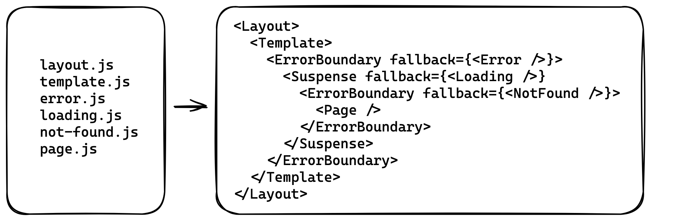
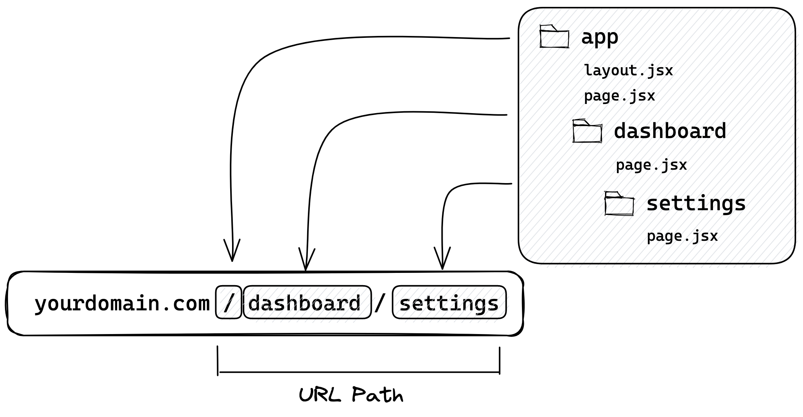

# Next.js 13 workshop

## 1 Installation
create next app new feature
```
npx create-next-app@latest --experimental-app
```

## 2 Routing Fundamentals
- https://beta.nextjs.org/docs/routing/fundamentals
- page.js：建立該路由的頁面，並且可以透過網址來訪問。
- layout.js: 建立給子路由共享的頁面，layout.jsx 會包住其子頁面。
- template.js: 用法和 layout.jsx 差不多，如果有要共享的選單元件，可以放在這。
- loading.js：建立 Loading 元素給該 page 或是其子路由使用。
- error.js: 當該 page 或是其子路由發生錯誤時。
- not-found.js：當找不到該頁面時。
- head.js：定義該路由的 head 內容。
轉換成 React Component 後的關系圖，會依檔名一層一層的包。


### Route Segments


### TODO
建立 /about 頁

## 3  Organize routes
https://beta.nextjs.org/docs/routing/defining-routes#example-organize-routes-without-affecting-the-url-path
共用 layout

## 4 Dynamic Segments
https://beta.nextjs.org/docs/routing/defining-routes#dynamic-segments
動態 routes

## 5 SSR , ISR

### error

### api routes

### Client Component VS. Server Component
https://beta.nextjs.org/docs/rendering/server-and-client-components

### streaming